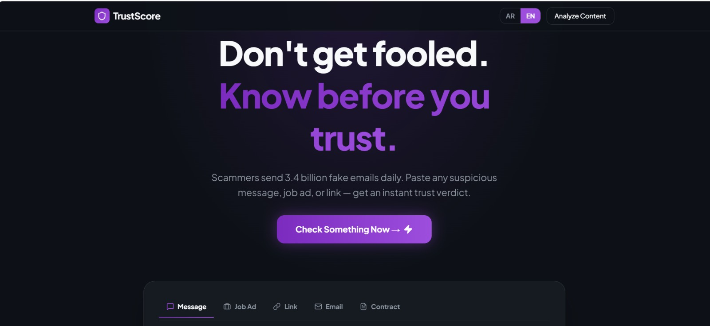
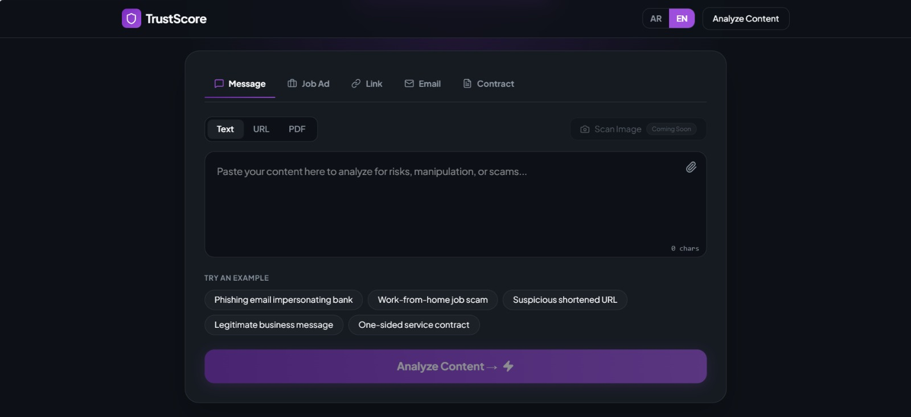
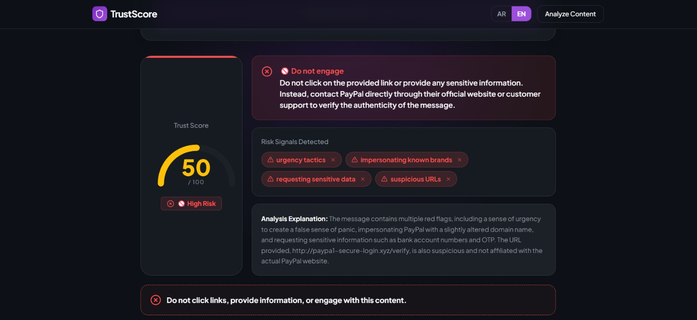

# TrustScore

An AI-powered fraud detection web application that helps users identify scams, phishing attempts, suspicious links, emails, job offers, and contracts before engaging with them.

## Overview

TrustScore analyzes user-submitted content using a Large Language Model (LLM) and provides:

- Trust Score
- Risk level assessment
- Detected scam indicators
- AI-generated explanation
- Practical safety recommendations

The platform supports both Arabic and English, making cybersecurity guidance more accessible to a wider audience.

## Features

- Analyze suspicious messages
- Analyze URLs
- Analyze emails
- Analyze job offers
- Analyze contracts
- Upload PDF files for analysis
- Bilingual interface (Arabic & English)
- AI-powered risk explanation
- Trust Score visualization

## Technologies

### Frontend
- React
- TypeScript
- Vite
- Tailwind CSS

### Backend
- Node.js
- Express.js

### AI
- Llama 3.3-70B
- Groq API
- OpenAI SDK
  
## Screenshots

### Home Page

### Analysis Process

### Result

## Project Goal

TrustScore aims to make scam detection simple and understandable for everyday users by transforming complex cybersecurity analysis into clear trust scores and actionable recommendations.

## Team

Developed during the AI Training Hackathon as a team project.
